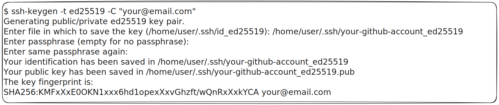

# ssh-keygen
how to get private key and public key to manage github account with ssh key
## 1- Create your public ssh key for your account github
1.1- Type the command bellow:
ssh-keygen -t ed25519 -C "your@email.com" 

1.2- Replace the id_ed25519 for your name github account. Ex: /home/user/.ssh/your-github-account_ed25519:
Enter file in which to save the key (/home/user/.ssh/id_ed25519): /home/user/.ssh/your-github-account_ed25519

1.3- type your password or empty for no password.
Enter passphrase (empty for no passphrase):

1.4- repeat your password.
Enter same passphrase again:

1.5- Your public key is located at the address below
Your public key has been saved in /home/user/.ssh/your-github-account_ed25519.pub

## 2-Step by step to insert your public key in your github account
2.1-Now login to your github account and click on your profile/avatar.
2.2-Go to settings and click here
2.3-Now click on ssh and gcp keys
2.4-Go to New SSH key and click here
2.5-As title enter your github account name
2.6-Now enter your public key in the text box area
2.7-And finally click on Add SSH key

## 3-Criando um gitspace - Gerenciando mais de uma conta no github:
[github.com/rprojetos/gitspace](https://github.com/rprojetos/gitspace)